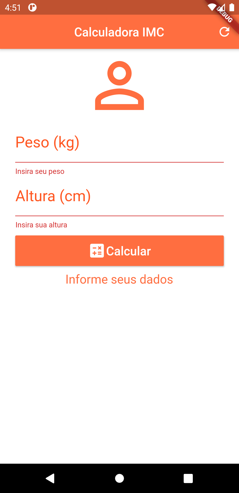
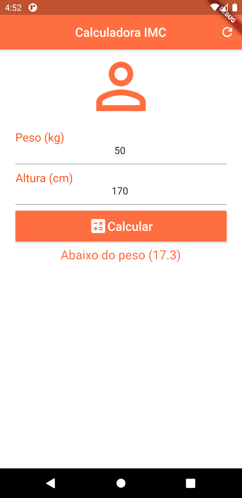

# Calculadora IMC

Projeto feito em Flutter

<h3>Descrição do aplicativo:</h3>
Aplicativo hibrido com o objetivo calcular o IMC de uma pessoa e apresentar se ela está acima do peso ou não.
O aplicativo contem apenas uma tela, nela você fornece o peso e altura.

<table style="width:100%">
  <tr>
    <th>Tela incial</th>
    <th colspan="3">Tela incial com os avisos</th>
  </tr>
  <tr>
    <td></td>
    <td></td>
    <td></td>
    <td></td>
  </tr>
</table>
